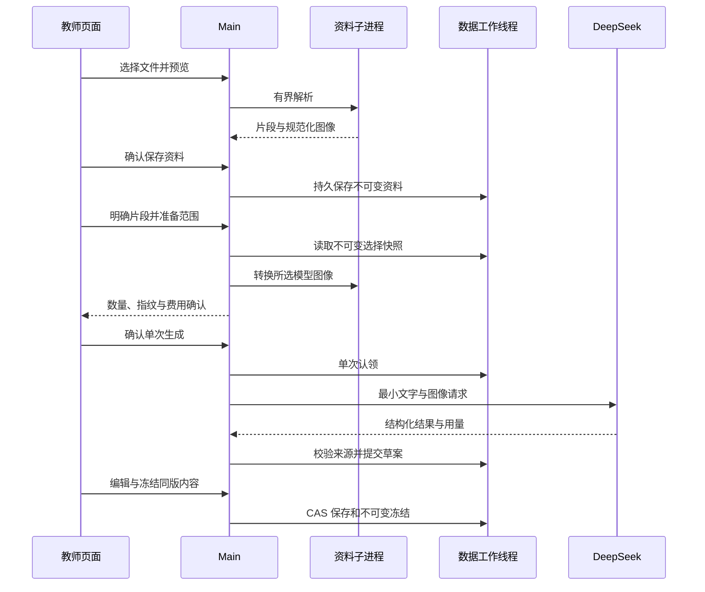

# 08 备课应用阶段验收

2026-10-01。工单 08 整单已通过。最终 699 项全仓检查、开发/打包桌面、一次获授权真实调用及 Standards/Spec 整单自审均通过，见 [最终验收矩阵](lesson-acceptance.md)。允许进入 09，07 冻结交付未变更。下方按阶段保留验证过程。

## 实现与边界

图中的页面到工作线程操作均经具名 Preload/Main IPC；没有直接数据库或文件权限。取消信号能阻止认领后的迟到结果提交，已提交数据由回读核对。

教师在原生文件选择器中导入 TXT/DOCX/PDF/PNG/JPG，先核对本地解析，再确认保存不可变资料版本。PDF 文字与页面图像同页对照；扫描页使用图像，不冒称已完成 OCR。保存原件副本只能从后台所属资料读取，不能传任意源路径。部分解析必须明确确认警告后才能准备模型范围。

页面跨资料选择确切片段，列出本地文件名及片段编号；准备阶段只进行本地校验和图片转换。Main 私有保管最终请求，Renderer 仅收到令牌、数量和指纹。原件、文件名、哈希、未选片段、解析警告及既有教师备注不随模型请求发送。图片在受限资料子进程中转为 JPEG，最长边 2048、每张 1 MiB、最多 8 张/总计 8 MiB；子进程可取消、超时终止，不在 Main 解码。模型请求只使用内联图像，没有远程图像 URL。

费用确认后才生成：deepseek-flash、JSON 对象模式、最多 16384 输出 Token、60 秒时限。每次准备只能认领一次；取消、失败、恢复和重启均不自动重试。已知响应 ID、模型与用量保留在草案和账本中，包括坏结构或截断响应的已知用量。协议依据：[官方图像指南](https://api-docs.deepseek.com/guides/vision/)与[官方聊天接口](https://api-docs.deepseek.com/api/create-chat-completion/)。当前桌面证据使用明确的合成 transport，不能等同真实服务商验收。

同一个可编辑内容包含目标、重点、难点、教学环节、课件、原生表格及资料图像引用。资料依据与补充建议分别标识；引用按钮定位到所选原文。教师可编辑并保存，也可冻结为不可变版本、从最新冻结版创建本地修订草案。参考答案、环节私有备注、课件私有备注独立存储；课堂投影过滤仍为核心函数，投屏窗口属于工单 10。

编辑未保存时阻止切换草案、导航及生成。范围确认和冻结/丢弃确认期间锁定编辑、插图及内容替换；保存与回读全部完成后才解锁，避免迟到读取覆盖新编辑。冻结采用后台 revision CAS 和最新基线检查；网络返回不能覆盖既有版本。

## 验证

完整 `npm run check`：697 项测试、38 个文件及格式、类型、Lint、构建通过，日志 `output/08-application-full-check.log`。资料子进程/模型编排/Main/导入专项 71 项通过，日志 `output/08-application-isolation-check.log`。此前资料、Schema 6、备份、迁移与崩溃证据见 `material-import.md`、`lesson-storage.md`。

`scripts/lesson-ui-smoke.mjs` 在实际 Electron、Preload、Main、资料子进程和 SQLite 中执行真实页面操作，只有文件对话框和模型 transport 为明确替身。开发版与独立打包版均通过：五种格式、PDF 对照、最小文字/图片出站、费用开关、准备期间锁定、保存后延迟回读锁定、冻结确认锁定、修订历史、离线/坏结构不覆盖、取消后的迟到响应、无凭据重开、360 像素无横向溢出。每套 4 次合成调用，外部请求 0，页面 errors 空数组。已实际查看两种宽度的编辑页面，文字和控件清晰。

- 开发报告：`evidence/08-application-development-report.json`。
- 打包报告：`evidence/08-application-packaged-report.json`；该 EXE 使用自身 ASAR 内的 Main/解析器及原生依赖。
- 打包源 `output/ticket08-pack/win-unpacked` 和 C 盘副本路径、EXE/ASAR 相同哈希：`evidence/08-application-package-manifest.json`。
- 两种宽度截图：`evidence/08-application-{development,packaged}-lesson-editor-{desktop,360}-viewport.png`。

此为独立可运行候选，未构建安装器、未覆盖用户安装程序，也未覆盖 `release/ticket07-20260930/`。

## Standards 自审

固定基线 `output/08-application-baseline-MNyy3t`，HEAD `8026afa52ca58c1bf1750662017f32c70e88fbd4`。独立 Standards 审计发现确认期间可编辑、异步回读提前解锁、Sharp 图片转换运行在 Main 三项，均已修复。复审剩余发现 0；新的图像任务仍校验输入哈希、格式、尺寸与字节边界，Renderer 权限未扩大。

## Spec 自审

独立 Spec 审计发现确认/准备期间新编辑可能被覆盖，以及保存回读竞态，两项均已修复。复审通过，并以本地替身验证图片转换期间取消不会复活准备包、付费调用为 0、任务槽释放。实际桌面随后验证修复。结论限于应用阶段，不代替整单真实接口验收。

## 最后待验

`scripts/lesson-live-smoke.mjs --dry-run` 已通过，凭据读取 0、请求 0。拟在已审计的独立打包程序与隔离数据目录，用一段合成物理教材和一张 320×180 示意图执行一次真实请求；最多 16384 输出 Token、60 秒，无自动重试。验证模型结构、来源、账本、教师保存冻结以及删除测试凭据后的重开。

该脚本必须显式 `--allow-one-paid-request` 并指定凭据目录和程序；原凭据前后校验、仅复制加密上下文、结束清除测试凭据。生成前写持久标记并原子预留，已尝试或结果不明时禁止重复。05 的单次授权已经使用，07 的视觉反馈不授权新的费用。取得本次明确授权后才能运行；真实检查和整单双轴最终审计通过后才可关闭 08。

调用脚本追加 Standards/Spec 审计曾发现标记未 fsync、教师保存缺少内容断言、凭据预检绕过收尾，均已修复。预留文件 fsync；报告完整写入并 fsync 后原子发布，故障保留旧证据。新增 flush/rename 故障两项，`tests/live-audit-guards.test.ts` 共 6 项通过，类型与 Lint 通过。编辑后读取并核验标题、revision/status、模型原稿；冻结内容须与保存稿全量相等，并在无凭据重开后再次全量核对。两路复审剩余发现 0。此追加结果不表示已经执行真实请求。

用户随后明确回复“授权这 1 次真实调用”。调用于 `2026-09-30T23:33:59.142Z` 开始、`23:34:08.158Z` 完成（中国时间 2026-10-01）。实际使用审计过的独立打包程序和隔离目录，经原始 fetch 向官方接口发起 **1 次**请求。返回 deepseek-flash，输入 11140、输出 1405、合计 12545 Token；草案与账本用量/响应 ID 一致。证据 `evidence/08-live-generation-report.json`、`08-live-draft.png`。

实际结果为一个 10 分钟环节和一张课件，文字引文来自所选合成教材，图片只描述为示意图，教学补充单独标记。已人工阅读本次模型稿；答案中“改变力的作用效果可能改变”有语病，仍需教师修订，不将通过结构校验等同教学内容总是正确。没有额外真实请求，也不为修辞问题自动重新生成。

教师标题修改保存为 revision 2，再冻结为草案 revision 3/不可变版本 1；全量断言冻结内容与保存稿一致，模型原稿保持不变。清除测试凭据和加密上下文后重开，冻结记录全量一致、配置未启用，网络被禁止。原凭据及原加密上下文前后校验相同。此次单次授权已使用；后续工单真实调用须新授权。08 尚待整单最终 Standards/Spec 审计，不能仅凭这次成功关闭所有工单。
