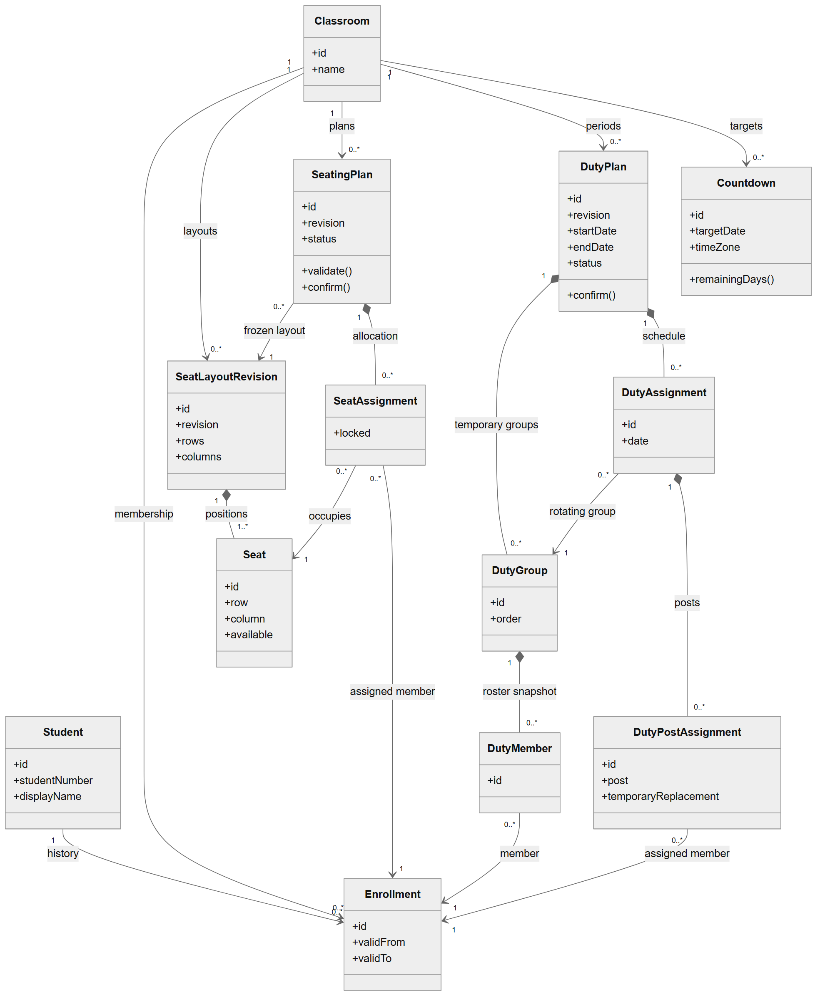
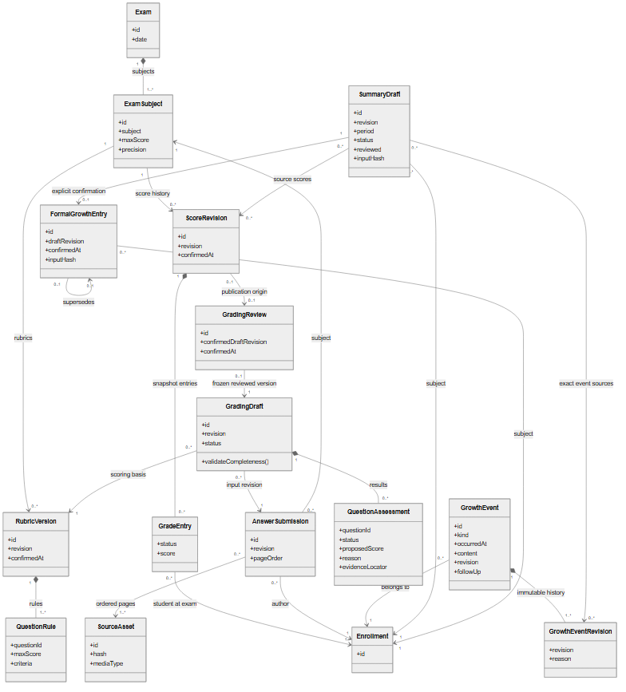
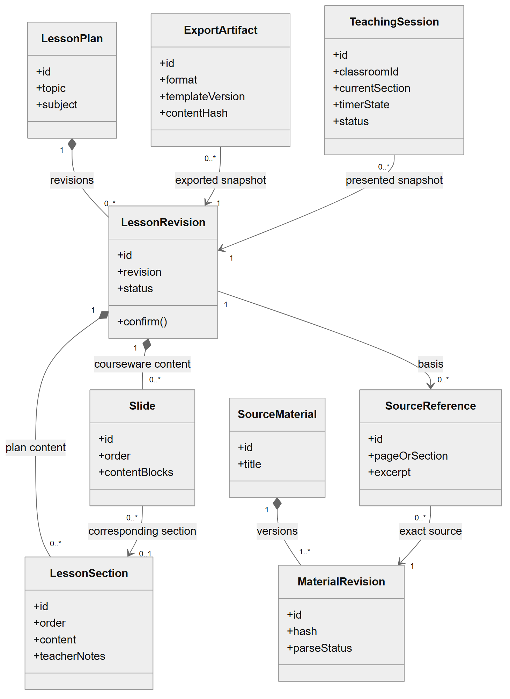

# UML 领域类图

2026-10-02 用户新增18：对话默认首页、侧栏置顶、多轮上下文与只读工具自动衔接，工具结果在Main统一脱敏后回传；发送消息代替逐次外发预览，正式写入仍确认。18软件整单通过：58文件/1014项全仓检查、开发/独立包对话、通用两套各10重开、供应商/外设回归及Standards/Spec均通过，Schema/备份11、管理130项。详见[18对话策略](../handoff/agent-conversation.md)。下方旧状态和冻结证据属于18改动前的历史版本；15仍待外部交接，原ZIP及16/17差异未重建。


2026-10-02 实现状态：14、16、17均已整单通过，当前15交接验收中。[外设接口图源](diagrams/devices.mmd)、[SVG](diagrams/devices.svg)记录DeviceGateway校验/有限等待/会话幂等及Adapter持久回执契约，当前默认未接入。模型独立配置及传输见[模型供应商图源](diagrams/model-providers.mmd)；Main一次外发/有限提议/另行写入确认/回执及导航见[业务对话图源](diagrams/conversation-entry.mmd)。16、17没有新增业务表，当前Schema/备份11。业务类图与工程流程图分别记录领域实体和实现边界。

日期：2026-09-29。状态：概念模型草案，不是数据库迁移或已实现的类。

类名采用稳定英文标识，解释采用中文；图中省略通用时间戳、审计字段和外键细节。组合关系表示版本内对象的业务归属，不意味着允许物理级联删除已引用历史。属性未声明完整类型，实施时应使用明确类型与运行时校验。

## 1. 班务

可编辑图源：[classroom.mmd](diagrams/classroom.mmd)；缩放查看：[SVG](diagrams/classroom.svg)。



- `Classroom / Student / Enrollment`：班级、学生、成员关系。学生转班不换身份，历史安排继续指向当时成员关系。
- `SeatLayoutRevision / Seat`：布局版本及座位；布局修改不能改变已有座位计划。
- `SeatingPlan / SeatAssignment`：计划版本与逐人位置，包括锁定状态。
- `DutyPlan / DutyGroup / DutyMember / DutyAssignment / DutyPostAssignment`：当期计划、临时组、成员快照、日期轮换、岗位到人；临时替换作用于具体安排，不改写整期组员。
- `Countdown`：班级可配置目标日与时区。

额外约束：已确认座位计划中每名应安排成员恰好出现一次，每个可用座位最多一人；成员必须属于该计划班级及有效期间。已确认值日计划中组员必须有效且组不为空，同一成员不能同时占用冲突岗位。岗位安排通常来自当日轮值组，教师可明确指定有效成员作临时替换；不得因此改变其他日期。图中 `0..*` 允许尚未填完的草稿，不表示空草稿可确认。

## 2. 评价与成长

2026-10-02 工单 13 实现映射：`GrowthBook` 保存 `growth_events` 当前事实及 `growth_event_revisions` 不可变修订；`growth_summaries` 是独立待审草稿，`growth_summary_revisions` 保存连续编辑/放弃/确认状态；`growth_summary_entries` 是明确确认后的不可变正式条目。来源绑定同一学生、成员 revision/班级、阶段及确切事件修订/成绩版本。事实变化只提示历史过期，正式更正创建后继并保留父条目；总结条目不作为新事实来源，避免自循环。图中事件事实和正式总结现已分开，见 [成长档案](../handoff/growth.md)。

2026-10-02 工单 12 实现映射：`ScorePublication` 是成绩模块的准备、确认和状态边界，`grading_publications` 用不可变复核 ID 作幂等主键并关联确切成绩父版/新版本；新 `score_versions` 的可选 publication 来源与该记录双向校验。只变更单学生单科，两个写入同事务。下方 11 阶段不入分描述仅指冻结动作；12 的另行明确确认已落地，成长档案在 13 实施。概念发布关系保持不变，见 [正式入分说明](../handoff/score-publication.md)。

2026-10-01 工单 11 阶段实现：`RubricVersion` 映射为不可变 `rubric_versions`；`GradingDraft` 保存当前答卷来源、逐题建议及教师复核，`grading_revisions` 以连续版本保存创建、人工修改、重绑、生成与冻结的完整快照；`grading_attempts` 单独保存每次模型任务的范围、终态、返回原稿与可观测提供方信息。`GradingReview` 映射为不可变 `grading_reviews`，内容必须与冻结草案及其最后修订一致。逐题行携带整份来源指纹；页序、角色和原图位置显式保存，像素取整映射与实际外发图像一致。此阶段只确认复核，不产生 `GradeEntry`；正式入分和成长档案仍未实现。实际状态见[阅卷接续](../handoff/grading.md)。

可编辑图源：[assessment.mmd](diagrams/assessment.mmd)；缩放查看：[SVG](diagrams/assessment.svg)。



- `Exam / ExamSubject`：考试及科目、满分和精度；学校总分/选科规则另按成绩规格保存。
- `ScoreRevision / GradeEntry`：某考试科目的一次确认快照及逐生记录。成绩更正形成新版本，`status` 区分有效、缺考、缺失及未选考，非有效状态不用零替代。
- `AnswerSubmission / SourceAsset`：绑定学生与考试科目的答卷版本、原材料及页序。材料复用不等于答卷身份自动确定。
- `RubricVersion / QuestionRule`：已确认评分细则与逐题规则；模型不得改写满分或题目覆盖范围。
- `GradingDraft / QuestionAssessment / GradingReview`：建议版本、逐题证据与教师确认。确认后内容冻结，修订须重新审核。
- `GrowthEvent / GrowthEventRevision`：当前本地事实与不可变旧修订，含日期、类型、跟进及必要修改说明。
- `SummaryDraft / FormalGrowthEntry`：待审总结和明确确认后的正式条目；来源引用与确认产物是不同关联，正式更正保留父条目。

发布约束：每份复核记录最多产生一次入分版本；一个入分版本可源自单份复核，也可以来自人工表格导入而没有复核来源。初版不做多份复核的原子批量发布，逐份发布须报告部分完成状态。快照中只有该学生被更新，其他成绩保留，预期版本冲突则暂停。

总结约束：事件和成绩可以分别为空，但合计必须有至少一项有效事实；没有事实时拒绝建立总结。成绩引用定位到确切版本和该成员条目，事件定位到确切修订；来源发生更正须提示过期。正式总结条目不能作为草稿的事实来源，防止循环引用。

## 3. 教学

2026-10-01 实现映射：08 已落地不可变 `MaterialVersion`、可编辑 `LessonDraftRecord` 和不可变 `LessonVersionRecord`。下图仍是概念模型；代码中草案与冻结版分别保存，冻结包含确切内容快照，修订另建草案并引用其冻结基线。当前资料记录与版本同 ID，一次导入一个不可变版本，未提供修改原资料的版本编辑界面。教案环节、课件及来源都归属该内容快照。09 的 `ExportArtifact` 体现为文件内版本/模板/内容哈希元数据和 Main 会话回执，不另建持久化回写表；回执仅授权打开本次未改写的文件。10 的 `TeachingSession` 已映射为 `teaching_sessions`：绑定班级和确切冻结版，保存所选页序、当前页、问题/答案选择、状态、单调计时的持久检查点与中断标记；运行锚点仅在 Worker 内存保存。`countdown_settings` 保存独立目标日期及时区，展示窗口通过允许字段投影读取。实际关系校验见 [资料备课存储交接](../handoff/lesson-storage.md)、[Office 导出交接](../handoff/office-export.md) 和 [课堂交接](../handoff/classroom.md)。

可编辑图源：[teaching.mmd](diagrams/teaching.mmd)；缩放查看：[SVG](diagrams/teaching.svg)。



- `SourceMaterial / MaterialRevision / SourceReference`：资料、不可变版本、页码或章节引用。
- `LessonPlan / LessonRevision`：备课主题与保存版本。版本包含教案环节 `LessonSection` 与课件页 `Slide`。
- `ExportArtifact`：指定内容版本与模板版本的导出记录，不是重新生成的内容。
- `TeachingSession`：某班级基于指定备课版本的一次课堂展示及进度，不表示学生掌握情况。

展示约束：`teacherNotes` 默认不出现在课件或课堂展示中。课件内容保存时执行展示校验，教师明确选择答案的展示时机。已开始的课堂不会因其他窗口修改草稿自动更换版本。

## 4. 图外约束

任务队列、凭据、备份清单、迁移、审计以及 DeepSeek/平台 Adapter 属于工程结构，不强行放入业务类图。职责及状态规则见[架构](architecture.md)。历史版本原则不意味着永久保留所有数据，未来真实业务启用前须另定留存、删除及备份清理规则。

自动生成的 SVG 与 `.mmd` 图源配套维护；渲染通过只能证明图源可处理，不能证明领域规则或实现正确。工单修改概念关系时同时更新词汇表、图源、图片与规格。

## 5. 渲染记录

2026-09-29 使用 Mermaid CLI 12.0.0 生成三份 SVG 和三份 PNG，并查看 PNG 检查类名、属性和连线。采用[固定渲染配置](diagrams/mermaid-config.json)改善关系标记的可读性；关系较多时使用 SVG 放大，并以图源和上文约束核对。

在仓库根目录复现单图 SVG 的已执行命令如下；另两图替换文件名即可。此命令只生成文档图示，不是应用构建或测试。

```powershell
rtk npm exec --yes --package=@mermaid-js/mermaid-cli@12.0.0 -- mmdc -i docs/planning/diagrams/classroom.mmd -o docs/planning/diagrams/classroom.svg -c docs/planning/diagrams/mermaid-config.json -b white
```

PNG 使用同一图源及配置，将输出扩展名改为 `.png`；本轮班务、评价与教学分别使用 `--size 2400`、`--size 2800`、`--size 2000`。初次执行可能下载渲染依赖；它不是客户端的运行依赖。
